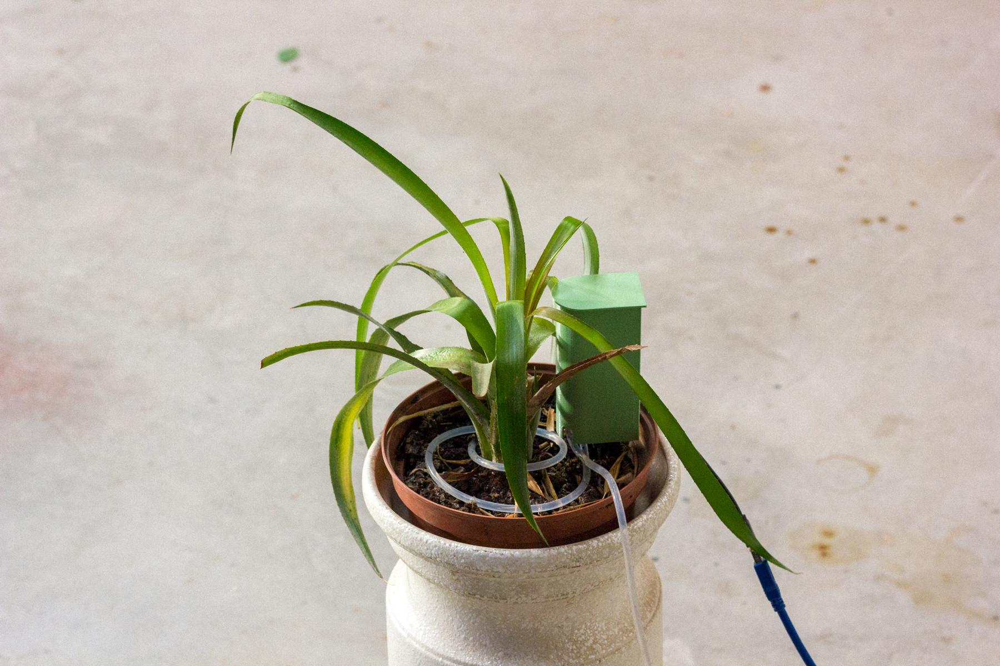
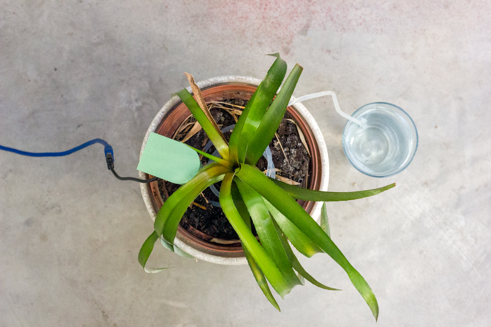
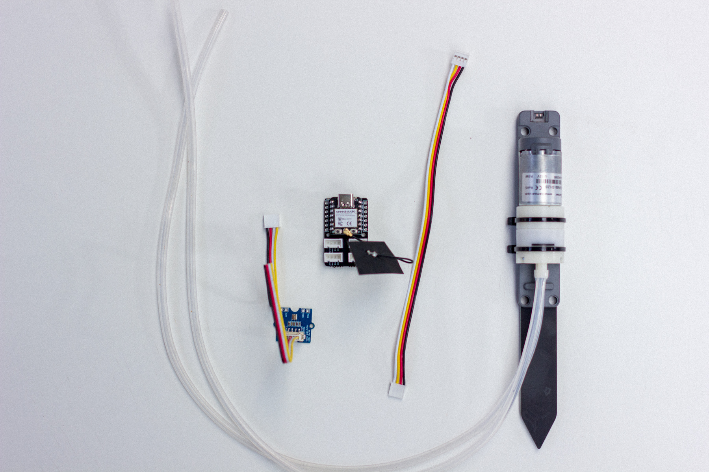
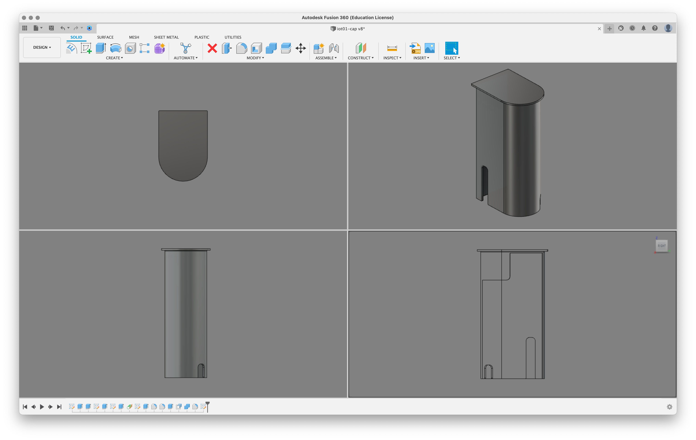
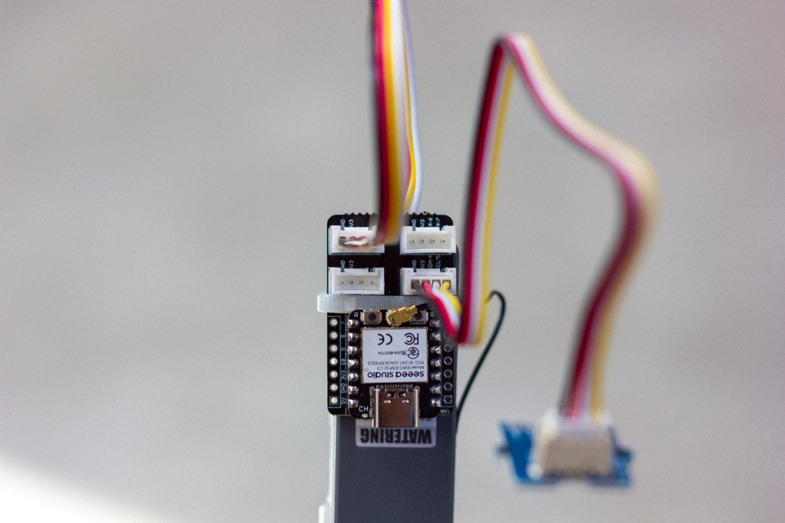
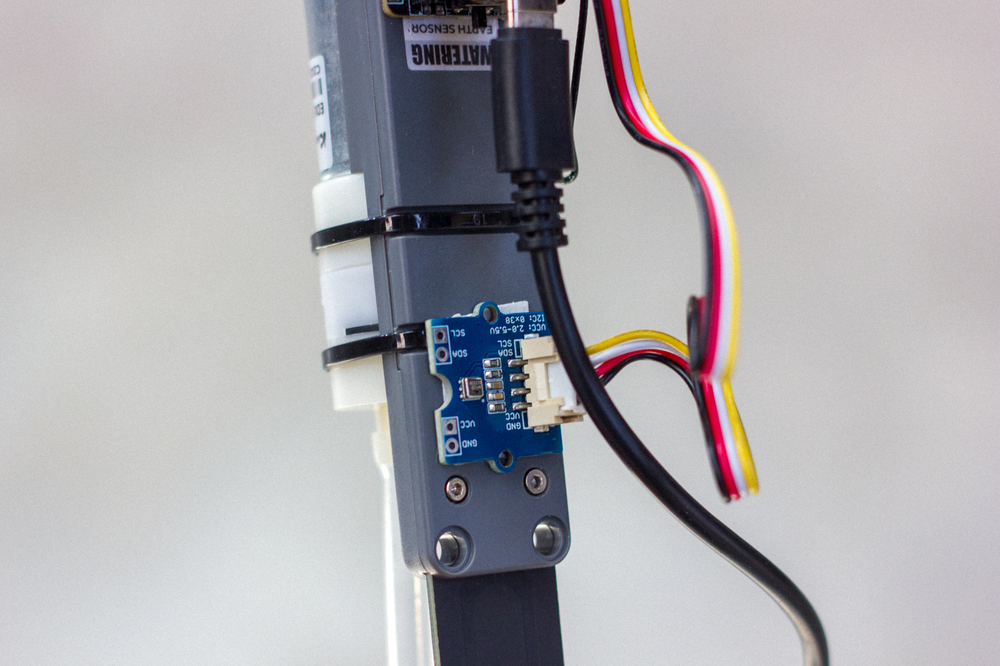
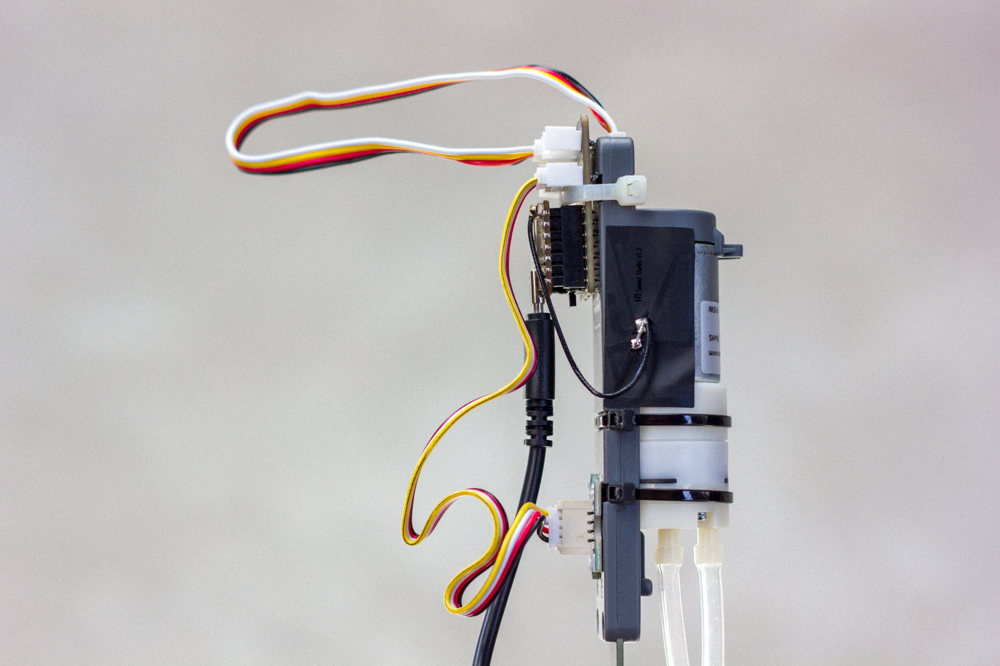
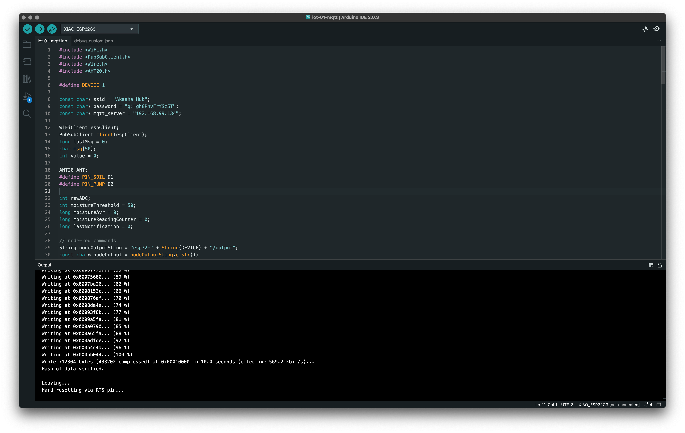
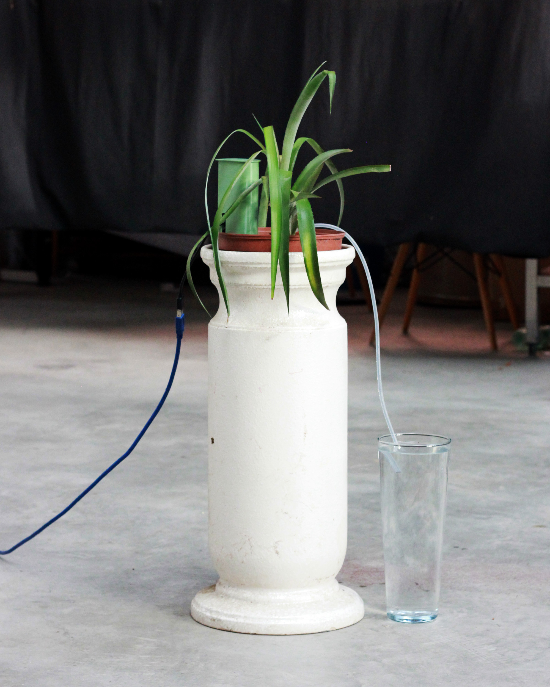

# Gardening Station

A smart device connected to a plant, which measures the soil moisture level, the ambient temperature and humidity and based on the data collected it waters the plant to meet its needs.

## Hardware

### Components

- Seeed Studio XIAO ESP32C3
- Grove Shield for Seeed Studio XIAO
- Watering Unit with Mositure Sensor and Pump
- AHT20 Temperature and Humidity Sensor
- [3D-printed cap](iot-gardening-station-cap.stl)

### Assembly instructions

1. Break the XIAO ESP32 at the divider to reduce its size
2. Attach the XIAO ESP32 to the top of the watering unit with a plastic collar
3. Connect the antenna to the XIAO ESP32 and stick it on the side of the water unit
4. Connect the sensor to the board with a Grove cable to pin 4 and 5
4. Connect the water unit to the board with a Grove cable to pin 1 and 2
5. Tape the sensor to the base of the watering unit using double-sided tape
6. 3D print the cap and place it on the unit to cover everything

## Software

### Arduino

Arduino allows us to program our board so that it acts as desired. Create a new arduino project and paste the code from [iot-gardening-station-arduino.ino](iot-gardening-station-arduino.ino) into it. It will most likely be necessary to install the few libraries used.

#### Library

- [AHT20](https://github.com/Seeed-Studio/Seeed_Arduino_AHT20)
	1. from Github: Download .ZIP 
	2. In Arduino IDE: Sketch > Include library > Add .ZIP library and select the previously downloaded file

## Links and references

- [Getting Started with Seeed Studio XIAO ESP32C3](https://wiki.seeedstudio.com/XIAO_ESP32C3_Getting_Started/)
- [Grove - AHT20 I2C Industrial Grade Temperature&Humidity Sensor](https://wiki.seeedstudio.com/Grove-AHT20-I2C-Industrial-Grade-Temperature&Humidity-Sensor/)
- [Arduino IDE - Importing a .zip Library](https://docs.arduino.cc/software/ide-v1/tutorials/installing-libraries)
- [Grove Shield Pinout](https://wiki.seeedstudio.com/Grove-Shield-for-Seeeduino-XIAO-embedded-battery-management-chip/#hardware-connection)
- [Watering Unit example](https://github.com/m5stack/M5Stack/blob/master/examples/Unit/WATERING/WATERING.ino)

## License

The code is under the [MIT LICENSE](LICENSE), the assets are [BY-NC-SA 4.0](LICENSE.by-nc-sa-4.0.md).

